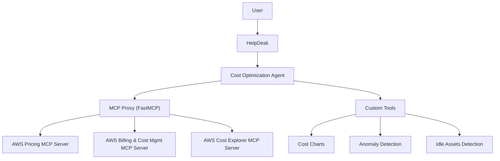

# DuploCloud AWS Cost Optimization Agent

A modular **service desk agent** designed to integrate with **DuploCloud HelpDesk**.  
This agent provides **AWS cost optimization insights** by orchestrating AWS MCP servers (Pricing, Billing & Cost Explorer) through a custom **MCP Proxy**, and augmenting them with **custom tools** for anomaly detection, rightsizing, and cost visualization.

---

## High-Level Flow



## ✨ Features

- **Cost Optimization Agent**
  - FastAPI agent serving `/health` and `/api/sendMessage`
  - Routes user messages into AWS MCP servers and custom tools
  - Provides actionable AWS cost optimization recommendations

- **MCP Proxy**
  - Built with FastMCP
  - Converts **STDIO ↔ SSE** to bridge AWS MCP servers
  - Supports:
    - AWS Pricing MCP Server
    - AWS Billing & Cost Management MCP Server
    - AWS Cost Explorer MCP Server

- **Custom Tools**
  - `idle_assets.py` → detects unused EC2/EBS/EIP resources
  - `cost_anomaly.py` → identifies anomalous spend patterns
  - `cost_chart.py` → visualizes cost trends (`/charts/cost-trend.png`)

- **DuploCloud Integration**
  - Deployed as **two Kubernetes services** (`cost-agent`, `mcp-proxy`)
  - Runs inside a DuploCloud tenant namespace
  - Integrated with **HelpDesk** as an *External HTTP Agent*

---

## 📂 Repository Structure

```
├── agent_server.py # FastAPI server entrypoint
├── main.py # Bootstraps the agent
├── agents/
│ ├── aws_cost_agent.py # Core cost optimization agent
│ └── ... #
├── mcp_proxy/ # MCP Proxy code
│ ├── main.py
│ └── ...
├── tools/ # Custom agentic tools
│ ├── idle_assets.py
│ ├── cost_anomaly.py
│ └── cost_chart.py
├── schemas/ # Pydantic models (messages, charts)
├── services/ # AWS service integrations
├── requirements.txt
├── Dockerfile # Agent container
├── mcp_proxy/Dockerfile # MCP Proxy container
└── README.md # You are here
```
---

## 🚀 Getting Started

### Prerequisites
- Python 3.11+
- Docker
- Access to a DuploCloud tenant with EKS integration
- AWS IAM role (via IRSA) granting **read-only pricing, CE, and EC2/CloudWatch** APIs

### Local Development

1. Clone the repo:
```bash
git clone https://github.com/<your-org>/<repo>.git
cd <repo>
```

2. Create virtualenv:
```bash
python -m venv .venv
source .venv/bin/activate
pip install -r requirements.txt
```
3. Run Agent locally:
```bash
uvicorn agent_server:app --host 0.0.0.0 --port 8000 --reload
```
4. Health check:
```bash
curl http://localhost:8000/health
```
5. Test message:
```bash
curl -X POST http://localhost:8000/api/sendMessage \
  -H "Content-Type: application/json" \
  -d '{"messages":[{"role":"user","content":"mcp ce ping"}]}'
```
## 🐳 Docker Images

- Agent Image = `ghcr.io/mmarconi93/duplocloud-cost-optimization-agent:latest`
- MCP Proxy Image = `ghcr.io/mmarconi93/duplocloud-mcp-proxy:latest`
Both are built and pushed via GitHub Container Registry (GHCR).

## ☸️ Kubernetes Deployment

The images are deployed via the manifests inside of the `/k8s` directory.

## 🔗 HelpDesk Integration

Register the agent as an External HTTP Agent:
- Name: cost-optimizer
- Base URL (same ns): http://cost-agent:8000
- Base URL (FQDN): http://cost-agent.<tenant-ns>.svc.cluster.local:8000

Health check
- GET /health → expects {"status":"ok"}

Message endpoint
- POST /api/sendMessage
- Header: Content-Type: application/json
- Sample body:
```bash
{
  "messages": [
    { "role": "user", "content": "mcp ce ping" }
  ]
}
```

## ✅ Status

- Agent built & containerized
- MCP Proxy built & containerized
- Deployed to DuploCloud tenant
- Verified service health and connectivity between Agent ↔ Proxy
- Final: Register External HTTP Agent in HelpDesk UI

## 📈 Example Queries

- `mcp ce ping` → sanity test MCP servers
- `cost summary last 7 days by service` → CE report (requires CE ingestion)
- `rightsizing recommendations` → Compute Optimizer (if IAM allows)
- `idle assets` → custom tool for unused EC2/EBS/EIPs
- `show cost chart` → renders trend via `/charts/cost-trend.png`

## 🤝 Contributing

- Fork and branch from main
- Add or enhance tools under /tools
- Ensure tests pass (pytest)
- Submit PRs with clear descriptions

## 📜 License

Apache 2.0 – see LICENSE