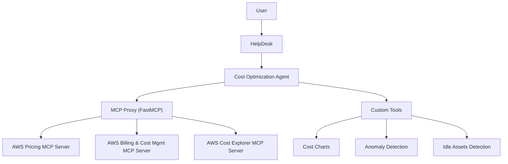

# Architecture Overview

The AWS Cost Optimization Agent integrates with **DuploCloud HelpDesk**  
to provide actionable cost recommendations by combining **AWS MCP servers** and **custom tools**.

## High-Level Flow

## Components

- Agent (/agents/aws_cost_optimization_agent.py)
    - FastAPI service exposing /health and /api/sendMessage
    - Routes user queries to Proxy or Tools

- MCP Proxy (/mcp_proxy)
    - Converts STDIO ↔ SSE
    - Spawns AWS MCP servers

- Custom Tools (/tools)
    - Extend agent capabilities (charts, anomalies, idle assets)

## Deployment

Two Deployments in Kubernetes
 - `cost-agent` (port 8000)
 - `mcp-proxy` (port 8080)

Services
- `cost-agent` ClusterIP
- `mcp-proxy` ClusterIP

Integration with HelpDesk
- Register agent as External HTTP Agent
- Health check: `GET /health`
- Message endpoint: `POST /api/sendMessage`